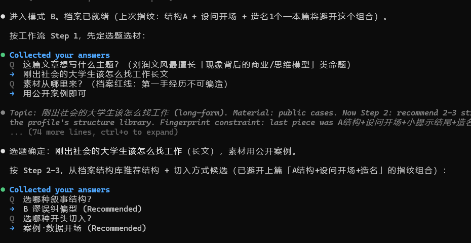
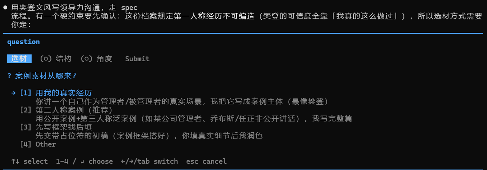
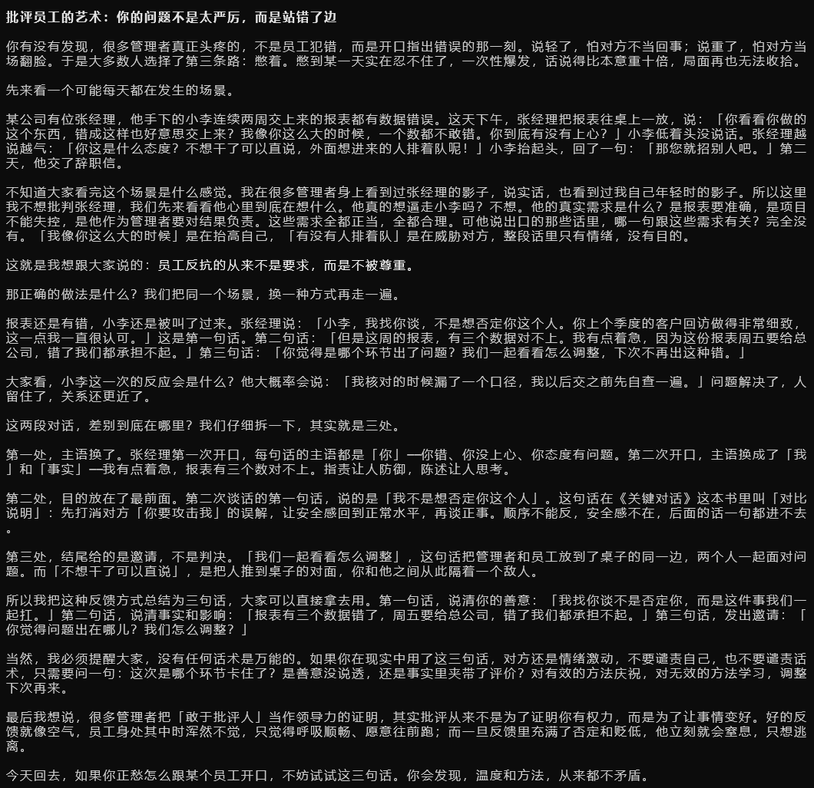

# style-still（写作资产蒸馏所）

    

> _"把原料蒸馏成可复用的写作资产。"_

一个仓库，内置多个**独立可装**的写作 Skills（沿用 Agent Skills 开放标准，Claude Code、Codex、QClaw、WorkBuddy 及 40+ Agent 都能装）。每个 Skill 都能单独用，合在一起是一条完整生产线：

```
原料（书 / 资料文件夹）──蒸馏──▶ 档案（文风 / 知识）──合成──▶ 能发布的成稿
```

---

> 🚧 **dev 分支**：三个 Skill 均已可用，`wechat-writer` 与 `knowledge-distill` 在持续迭代打磨，欢迎试用并提 Issue。

## 📋 Skills 目录

| 名字 | 一句话 | 状态 |
|------|--------|------|
| ✍️ **book-style-distill**（文风蒸馏） | 把一本书/一位作者的文风蒸成《文风档案》，再用档案 spec 式写作/润色——写出来是那个人的味道，不是 AI 味 | ✅ 稳定 |
| 📚 **knowledge-distill**（知识库蒸馏） | 把任意格式的资料文件夹蒸成单文件《知识档案》：事实带来源、素材按强度分级、红线可机械扫描 | 🚧 dev |
| 📮 **wechat-writer**（公众号长文写作） | spec 式 9 步流程写公众号：主题漏斗、GTB、营销段指纹防重复、四层质检——平台形态合规，不是散文 | 🚧 dev |

三个独立可装；组合用法：**知识档案（写什么）+ 文风档案（怎么说）→ wechat-writer 合成成稿**。

---

## ✍️ book-style-distill（文风蒸馏）

**模式 A · 蒸馏**：丢给它一本书（txt/md/epub/pdf）、几段节选，或一个书名

- 脚本全量采样：句长分布、对白占比、标点画像（本地运行，0 token）
- 全书小节开场扫描：开场方式真实占比，不靠抽样印象
- 16 个维度逐维蒸馏，**每条结论必须附原文例句**——没证据就标「不明显」，不编造
- 强制验证：仿写一段与原文对比，不像就回改档案

**模式 B · 写作**：「用《XXX》的文风写一篇关于 xxx 的文章」

- spec 式分步确认：选材 → 结构 → 切入（先交 100 字开头过目）→ 大纲 → 正文
- 四层自检：禁区机械扫描 → 风格一致性 → 内容质量 → 活人感终审
- **结构指纹防重复**：连续两篇不得雷同，日更也不乏味

## 📚 knowledge-distill（知识库蒸馏）

丢给它一个资料文件夹（md/txt/docx/pptx/pdf/xlsx/epub），产出单文件《知识档案.md》：

- **spec 式分步确认**：盘点 → 取舍清单（哪些要哪些不要，你定）→ 草案 → 冲突人审 → 总结清洗 → 验证
- 每条事实带来源（文件名+页码）；素材按来源强度五级分级（典籍/官方/媒体/网传/内部）
- 红线写成可 Grep 扫描的格式；容量纪律 ≤500 行，超出转指针
- 自带抽取器：docx/pptx/xlsx 零依赖直跑，纯图片 PDF 标待 OCR；增量补蒸不重蒸

## 📮 wechat-writer（公众号长文写作）

说一句「写篇公众号」即启动 9 步 spec：

判型 → GTB（这篇给读者什么）→ 骨架 → 文风 → 标题 → **开篇 100 字过目** → 大纲 → 正文 → 四层质检。

- **主题漏斗**：只给大主题（如"AI"）→ 拆 3 个最可能的细分方向（各带 GTB 与标题候选）→ 不满意可「换一批」
- **候选批次总则**：所有拍板环节都给 2-3 个最可能候选，可选/可改/可换批
- **三层模型防重复**：L1 声部保真（机制按位置条件采样，不当机制菜单）→ L2 选题谱（系列级排期轮换，新鲜感靠题材宽度）→ L3 指纹兜底（精确重复浅查，不进上下文）
- **骨架从作者来**：单篇结构取自文风档案的叙事结构库（每个作者自带 3-6 种真骨架），外加主题暗线规则——不用人造死配比
- **叙事者身份规则**：作者的声音可借，身份不可借——「我帮大家找清楚了」「有同学问我润总」类身份签名句式强制翻译为真身份，禁虚构读者来信
- **营销段生成公式**：信息量档位（A 一句带过/B 故事闭环/C 带细节）× 素材桥（本篇暗线）× 文风机制（档案取 2-3 个）——组合派生，禁模板贴片；产品事实轮换不连篇
- **平台形态层**：磁力标题、每屏一个信息点、断句呼吸感、「深一度」信息量、情绪立场一致、1800-2500 字弹性体量
- **幻觉分区**：叙事层放开（创意源），事实层校验（参数/引文/数据必须能回溯）

## 效果示例

**spec 流程 · 选题、结构与切入推荐（自动避开上篇的指纹组合）**



**spec 流程 · 硬约束（第一人称经历不可编造 → 必须向你索取素材）**



**文风写作成品（樊登文风《批评员工的艺术》）**



**文风写作成品（刘润文风《AI时代最大的机会》）**


## 适合

- 喜欢某本书/某个作者的文风，想让 AI 照着写
- 企业/团队：有内部资料库（产品资料、行业素材、合规红线），想让 AI 用自家知识 + 指定文风写稿
- 公众号、小红书等需要**持续日更且风格统一**的创作
- 想把自己的文章「润色掉 AI 味」

## 不适合

- 纯摘要、标题生成（用别的工具）
- 「通用好文笔」——这些 skill 是有立场的，只忠于档案里的声音和平台形态
- 一键全自动出稿——刻意保留分步确认，核心创意和真实经历必须来自你

## 安装

**装整个合集（推荐）**：在支持 Skill 的 Agent 里直接说：

```
帮我安装这个 skill 合集：https://github.com/ghoustghoust/style-still.skill
```

Agent 会把三个 Skill 目录全部装入 skills 目录。**合集装好后，技能之间可以互相触发**：写公众号时会自动发现并使用已有的文风档案/知识档案，缺档案时会提示你先蒸一份（见各 Skill 的 fallback 钩子）。

**只装单个**：把上面地址末尾加上 `/tree/main/book-style-distill`（或 `knowledge-distill`、`wechat-writer`）即装对应 Skill。也可手动把对应目录复制到 Agent 的 skills 目录（如 `~/.agents/skills/`）。

**环境要求**：Python 3.8+（仅标准库，零依赖；pdf 抽取需 PyMuPDF）。没有 Python 也能用——脚本只是加速器。

## 完整用法（三件套流程）

**① 蒸文风（每本书一次）**

```
用 book-style-distill 蒸馏 D:\book\xxx.epub
→ 产出《书名-文风档案.md》（书同目录）
```

**② 蒸知识库（每个资料库一次，之后走增量）**

```
用 knowledge-distill 蒸馏 D:\公司\资料文件夹
→ 分步确认（取舍/冲突人审/清洗）后产出《名称-知识档案.md》
```

**③ 写公众号（每一篇）**

```
给公众号写一篇 xxx（可指定文风：用刘润/汪曾祺/当年明月/罗振宇）
→ wechat-writer 自动 Grep 挂载档案，走 9 步 spec：
  主题漏斗 → GTB → 骨架（作者结构库）→ 文风 → 标题 → 开头 100 字过目 → 大纲 → 正文 → 四层质检
→ 交付正文（配图+封面提示词）+ 质检报告，指纹登记防连篇重复
```

**④ 系列排期**：多篇连写时按选题谱轮换「内容线 × 文风 × 结构」，连续两篇不完全重复；缺档案时 skill 会提示先蒸（fallback 钩子）。

## 未来开发计划（Roadmap）

| # | 计划 | 状态 |
|---|------|------|
| 1 | 同作者多本书：补充蒸馏与档案合并（冲突标来源、人审） | 待开发 |
| 2 | 多平台文案适配：小红书/微博/抖音/知乎，每平台一份《平台形态档案》 | 待开发 |
| 3 | 知识库蒸馏 skill（ingest + OCR + 增量） | ✅ 已发布（knowledge-distill，dev） |
| 4 | ~~成稿结构蒸馏~~（已变更） | 结论：单篇骨架直接取自文风档案的叙事结构库，不再单独蒸骨架；选题谱（系列排期）已在 wechat-writer 三层模型中落地 | 已闭环 |
| 5 | L5 事实校验：事实性声明逐条回溯/核查/降级 | 待开发 |
| 6 | 成稿示例库回填：验收稿回写档案例句 | 待开发 |
| 7 | 微信公众号长文写作 skill | ✅ 已发布（wechat-writer，dev） |

## 注意事项

1. **第一手经历不可编造**：写第一人称文章时 Agent 会向你索取真实经历——这是特性不是麻烦
2. **档案是证据文档**：每条规则都带来源/例句，删除后失去校准能力
3. **Token 消耗**：文风蒸馏约 4-6 万/本；知识蒸馏视原料量（万字级约 6-9 万，一次性）；写作约 1-3 万/篇
4. **迭代**：档案是活文档，把「不像」的点告诉 Agent，教训会写进迭代日志——越用越像

## 免责声明

本仓库的 Skills 是工具，**只负责按你提供的文本做蒸馏与写作**。**蒸馏什么数据、用谁的文风、用于何处，由调用者自行决定。** 调用者需自行确保文本来源合法、不侵犯著作权与人格权、用途合规。由此产生的一切责任**均由调用者承担**。请在合法合规、尊重原创的前提下使用。

## 🔒 私有档案库

已蒸馏好的文风档案、知识档案、书籍档案（原著+档案+采样）与成稿样例，存放于私有仓库（仅协作者可见，无权限访问将返回 404）：

**[style-still.skill-data_warehouse](https://github.com/ghoustghoust/style-still.skill-data_warehouse)** — 需要访问权限请在 Issue 中说明用途并申请成为协作者。

## License

MIT
